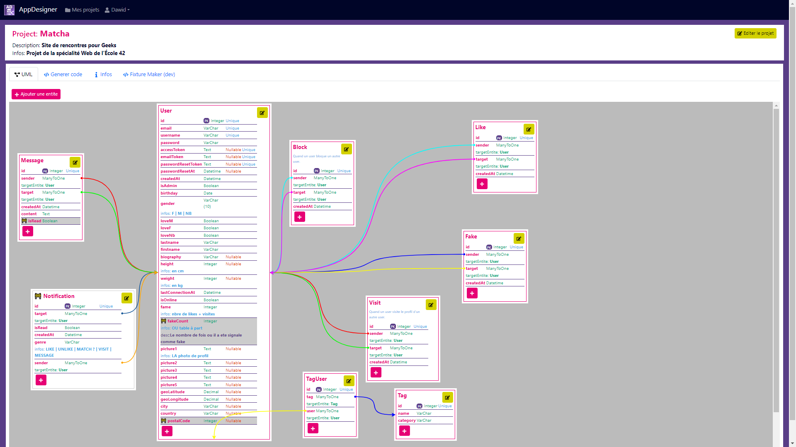

# ApplicationDesigner

&nbsp;&nbsp;&nbsp;
&nbsp;&nbsp;&nbsp;
&nbsp;&nbsp;&nbsp;

## About the project

Application Designer is a powerful tool that allows you to quickly create, customize, and generate code templates for your software projects. Built with NestJS and React, this application simplifies the process of setting up a project, defining entities and properties for a database, and generating code templates in multiple programming languages.

## Features

- **Project Creation**: Easily create new software projects with the necessary folder structure and configurations.

- **Entity and Property Management**: Define your project's entities and their properties for your database schema.

- **Multi-Language Template Generation**: Generate code templates in various programming languages, saving you time and effort.

## Demo

Lien vers le site : [appDesigner](https://appdesigner.zedixi.com)

## Built With

&nbsp;&nbsp;&nbsp;
&nbsp;&nbsp;&nbsp;
&nbsp;&nbsp;&nbsp;

## Running it locally

- create a `.env` file in `./back` folder (see `./back/.env.example` file)

#### With docker

- Run `docker-compose up` in the root folder to start the application.

#### Without docker

- Run `npm install` in `./back` and `./front` folders to install dependencies.
- Configure the DB server
- Run `npm run start:dev` in ./back folder.
- Run `npm start` in ./front folder.
